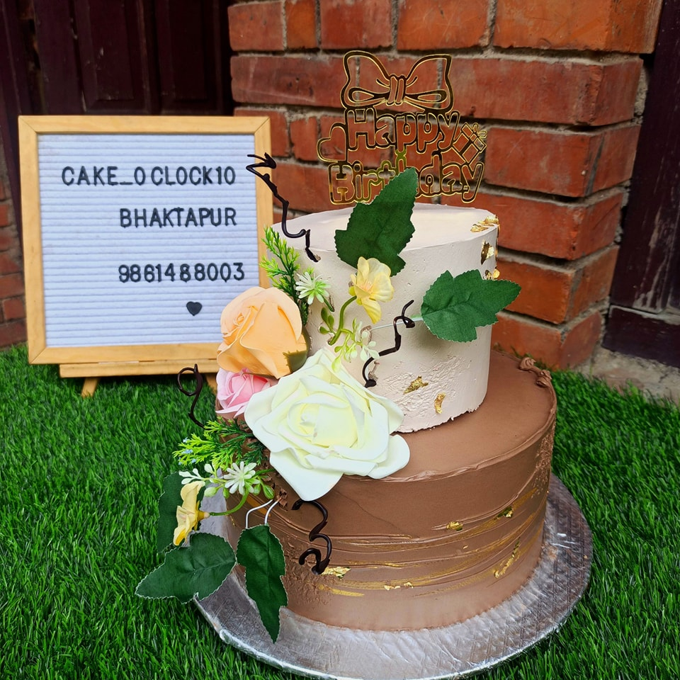
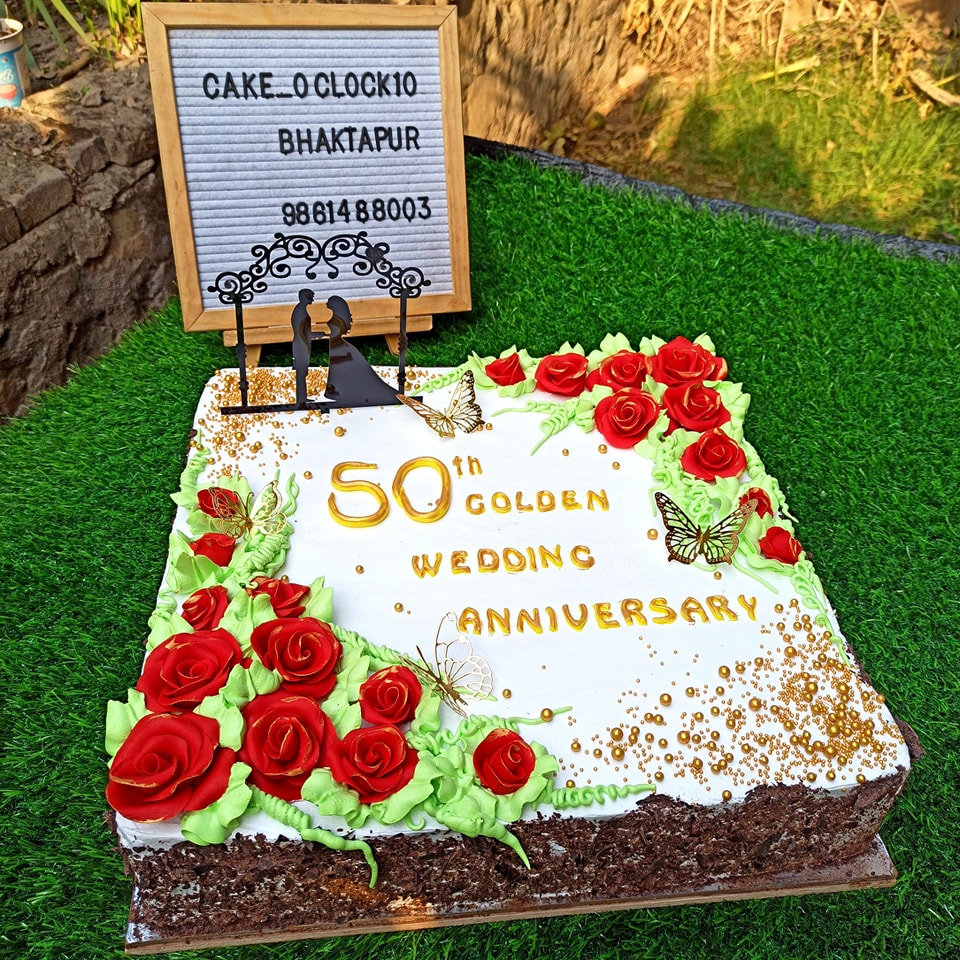
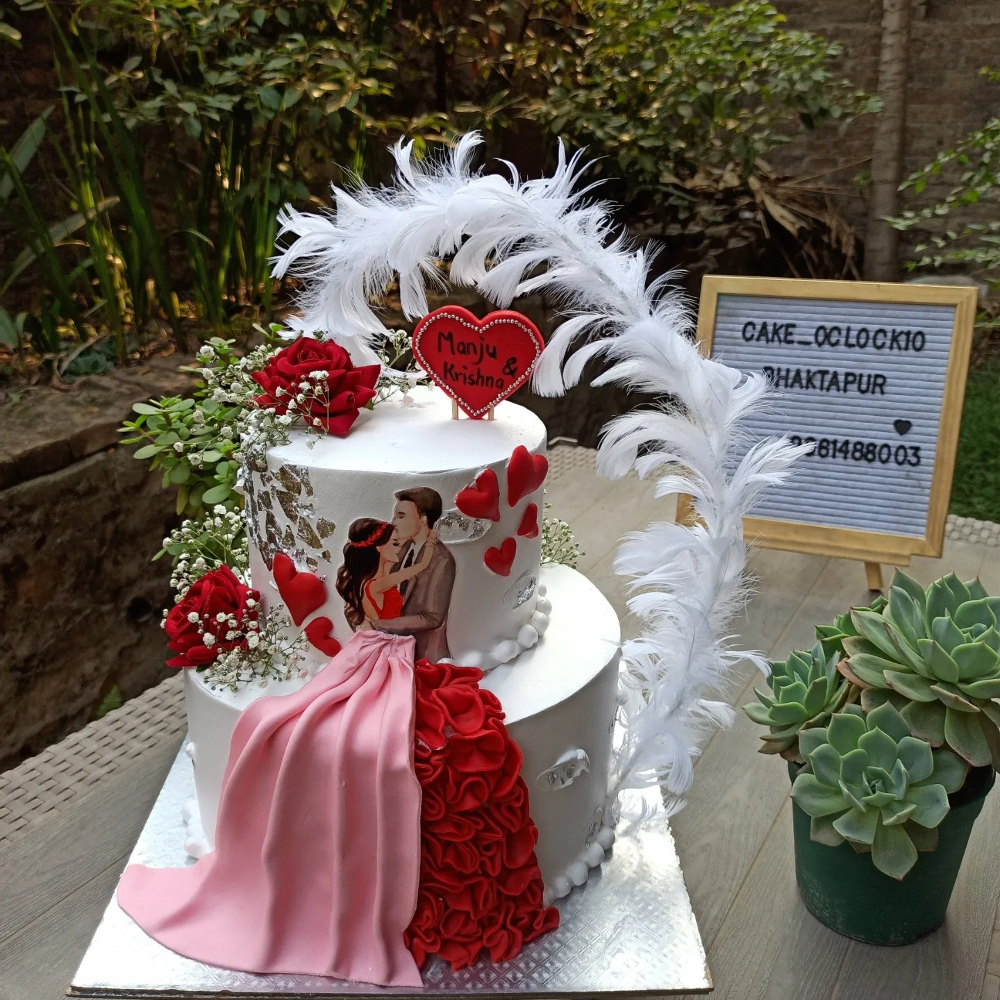

# Cake o' Clock Bakery

 This is a webpage of the Cake o' Clock bakery, created using HTML, JavaScript, and CSS. The profile of the bakery is on here. There are various pages where you can see the cakes for different occasions like a [Birthday](./images/birthday/bd1.jpg), [Anniversary](./images/anniversary/an1.jpg), and a [Wedding](./images/wedding/wed1.jpg).
   This webpage consists of 6 pages, an intricate mixture of HTML, JS, and CSS properties, and user-friendly navigation.

 

 

  
 There is a price page as well. On it, you can place an order, using the order form, by selecting the cake type, size and quantity. When you click on the PLACE ORDER button, it validates the form fields. The phone number field is validated using RegEx pattern.
   You can also provide a review about this baker through the review form.
### Repository
 Here is the link to my GitHub account: https://github.com/shovayakamionline/bakery
### Project Page
 Here is the link to my project page, hosted in GitHub: https://shovayakamionline.github.io/bakery/index.html